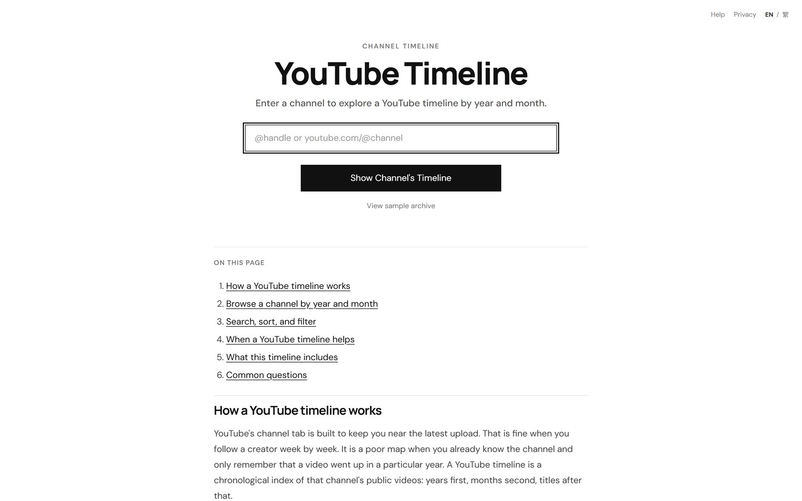
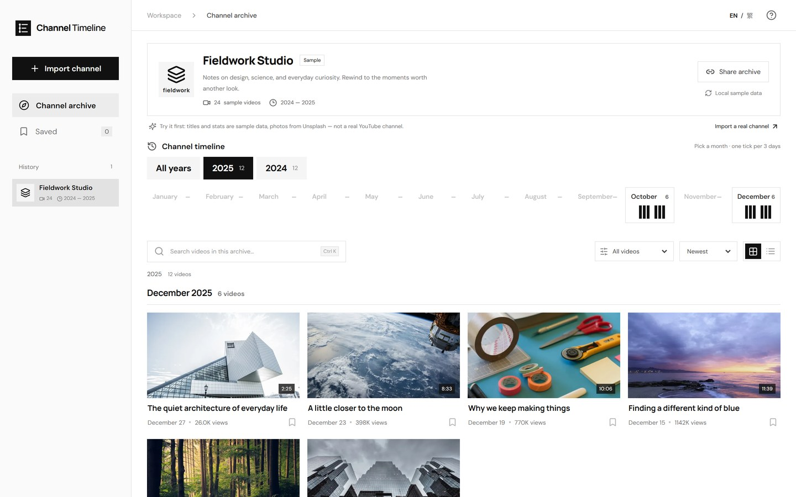

# Channel Timeline

| **Channel Timeline** | **Quick Overview**                                                                                                                                                |
| -------------------- | ----------------------------------------------------------------------------------------------------------------------------------------------------------------- |
| URL                  | [https://channeltimeline.cc/](https://channeltimeline.cc/)                                                                                                        |
| What it does         | Builds a date-ordered index of a YouTube channel's currently public uploads, so you can open a specific year and month instead of scrolling the channel video grid. |
| How to use it        | Paste a channel URL, @handle, or channel ID. Choose a year, then a month. Search titles, sort oldest first, or filter by duration and live replays.                 |
| Cost                 | Free.                                                                                                                                                             |
| Account required     | No.                                                                                                                                                               |
| Cookies              | Google Analytics 4 only. No advertising or tracking cookies beyond that. Saved videos and channel history use browser local storage, not cookies.                  |
| Ownership            | Independent developer project, not affiliated with YouTube or Google.                                                                                              |
| Use in Reporting     | Establishes what a channel published during a given window, and makes upload cadence, gaps, and periods of inactivity visible at a glance.                          |

### What does Channel Timeline do?

Channel Timeline turns a YouTube channel's public uploads into a chronological index: years first, then months. It exists because a channel page is built to surface recent videos, which is the wrong shape when you already know the channel and only need to know what it published in a particular period.

Paste a channel URL, an @handle, or a channel ID and the tool resolves the public channel and indexes the uploads YouTube currently returns. Each year expands into month cards showing how many public videos landed in that month, along with a small distribution bar indicating whether uploads clustered early or late in the month. You can then search titles, sort oldest first, or filter by duration and live replays.

**The lowdown:** It is a date-first view of a channel's public catalogue. It does not archive, download, or recover anything — it reorganises what is publicly available right now so that "what did this channel post in March 2019?" becomes a direct question rather than a scrolling exercise.

It is a general-purpose browsing tool rather than purpose-built investigation software, but the date-first view maps directly onto a common research question, which is why it is listed here. Its limitations are listed in full below.

### How to Use:

**1. Paste a channel address into the box at the top of the page.** A `youtube.com/@handle` URL, a `/channel/UC…` URL, or a channel ID all work. Legacy `/user/` names usually work. A link to a single video is not enough.

**2. Wait for the public channel to resolve.** This usually takes a few seconds. On large channels the full time index continues building in the background, and videos appear as they arrive.

<figure><figcaption>Enter a channel URL, @handle, or channel ID to begin.</figcaption></figure>

**3. Choose a year, then a month.** Month cards show the number of public uploads in each month. Empty months remain visible but disabled, which preserves the shape of the year.

**4. Narrow the results.** Search within the loaded archive by title, switch the sort to oldest first, or filter by duration and live replays.

<figure><figcaption>Year tabs expand into month cards showing how public uploads cluster across each month.</figcaption></figure>

**5. Select a title to watch on YouTube.** Playback always happens on YouTube; the tool does not host video files.

### Cost

* [x] Free
* [ ] Partially Free
* [ ] Paid

## Data Processing

### Account Required:

* [ ] Yes
* [x] No

### Cookies:

The site uses Google Analytics 4 to measure aggregate traffic. No advertising features or Google signals are enabled. Bookmarks and the list of channels you have opened are kept in browser local storage rather than cookies, and are never sent to the server. Channel metadata is fetched from the YouTube Data API and cached server-side so that repeat lookups do not repeat the API quota cost.

Further detail is published on the site's [privacy page](https://channeltimeline.cc/privacy).

### Use in Reporting

Channel Timeline is most useful in the **discovery and scoping stage** of an investigation, before you know which individual video matters. Typical uses:

* Establishing what a channel actually published during a specific window — a quarter, an election period, a protest cycle — rather than what a recommendation feed surfaces today.
* Identifying upload cadence and gaps: periods of silence, sudden bursts of activity, or a change in publishing rhythm over several years.
* Locating candidate videos from a known time range when only an approximate date is remembered, which is faster than reconstructing a title in global search.
* Cross-checking claims that a channel did or did not publish something, against the catalogue that is public now.
* Producing a shareable workspace URL that preserves a specific channel and filter set, so a colleague can open the same view.

| **Capabilities**                                                                                                | **Limitations**                                                                                                                          |
| --------------------------------------------------------------------------------------------------------------- | ---------------------------------------------------------------------------------------------------------------------------------------- |
| Indexes a channel's currently public uploads by year and month, with per-month upload counts and distribution.   | Only lists videos that are public at the time of sync. Deleted, private, or unavailable uploads cannot be displayed or recovered.        |
| Searches titles, sorts newest/oldest/most viewed, and filters by duration and live replays within the archive.   | Title search covers only the loaded channel archive. It does not search across YouTube, and it does not search captions or spoken words.  |
| Shareable workspace URLs that preserve the selected channel and filters.                                         | No export, no CSV, and no API. It is not built for evidence capture or chain-of-custody workflows.                                       |
| Free, no account required, and no YouTube sign-in required.                                                      | View counts are cached snapshots from the last sync, not live figures.                                                                   |
| Independent Traditional Chinese interface available alongside English.                                           | Large channels index in batches, so a first import may take time to complete.                                                             |

### Summary

Channel Timeline answers a narrow, common question: what did this channel publish, and when? It is a convenience layer over the YouTube Data API rather than an archiving or verification tool.

**Note on absence:** because the tool only reflects what is public at sync time, a video's absence from a timeline is not evidence that it never existed. For deleted or private uploads, corroborate with archival sources instead.

### Ownership

An independent developer project, operated separately from YouTube and Google. The tool reads public metadata through YouTube API Services and sends users to YouTube for playback.

### Ethical Considerations

* Absence of a video from a timeline does not mean it never existed; deleted and private videos are out of scope by design.
* Upload dates and cached view counts are metadata snapshots and should be corroborated before being cited as evidence.
* Respect privacy when researching channels tied to individuals, and consider the harm of amplifying material before republishing findings.
* Channel owners can request deletion of cached public metadata; the process is described on the site's privacy page.

### Related Tools:

* [Filmot](filmot.md)
* [YouTube Video Finder](youtube-video-finder.md)
* [Archivarix Tube Search](archivarix-tube-search.md)
* [Wayback Machine](wayback-machine.md)

#### Sources

[https://channeltimeline.cc/](https://channeltimeline.cc/)&#x20;

[https://channeltimeline.cc/privacy](https://channeltimeline.cc/privacy)&#x20;
