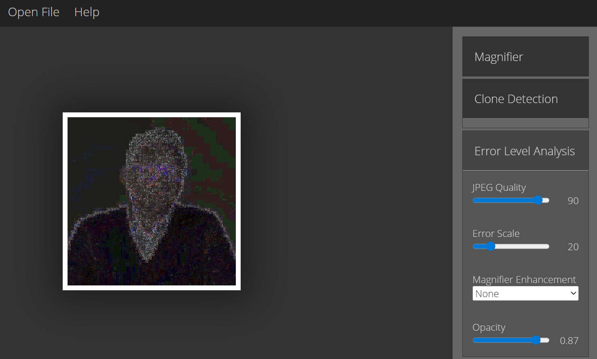

# Forensically

| **Forensically** | **Quick Overview**                                                                                                                                                                                                                                                                      |
| ---------------- | --------------------------------------------------------------------------------------------------------------------------------------------------------------------------------------------------------------------------------------------------------------------------------------- |
| URL              | [https://29a.ch/photo-forensics/#forensic-magnifier](https://29a.ch/photo-forensics/#forensic-magnifier)                                                                                                                                                                                |
| What it does     | Forensically is a collection of web-based digital image forensics tools used to examine and verify images. It includes clone detection, error level analysis (ELA), metadata extraction, noise analysis, and other visualisation features to help identify signs of image manipulation. |
| How to use it    | Upload an image directly into the Forensically interface, then choose a tool such as Magnifier or Clone Detection from the sidebar, adjust the settings as needed, and visually examine the highlighted areas for inconsistencies.                                                      |
| Cost             | Free                                                                                                                                                                                                                                                                                    |
| Account required | No                                                                                                                                                                                                                                                                                      |
| Cookies          | No - it may use minimal technical cookies necessary for website operation.                                                                                                                                                                                                              |
| Ownership        | Jonas Wagner, based in Zurich.                                                                                                                                                                                                                                                          |
| Use in Reporting | Useful during the verification and analysis stage of the OSINT workflow. After collecting and preserving an image, it helps you technically assess authenticity and check for signs of manipulation.                                                                                    |

### **What does Forensically do?**&#x20;

Forensically is a set of free web-based tools for digital image forensics. It currently includes ten tools;

* Magnifier
* Clone Detection
* Error Level Analysis (ELA)
* Noise Analysis
* Level Sweep
* Luminance Gradient
* PCA (Principal Component Analysis)
* Meta Data (EXIF Viewer)
* Geo Tags
* Thumbnail Analysis
* C2PA Content Authenticity
* JPEG Analysis

Basically, what you’ve got here is a broad technical toolkit for image verification and forensic inspection. It functions as a forensic enhancement tool, highlighting anomalies that may indicate manipulation, but it does not conclusively determine authenticity on its own.

**The lowdown:** As owner and creator, Jonas Wagner says, you should think of Forensically as a kind of magnifying glass – it helps you see details that would otherwise be hidden. But just like a magnifying glass, it can’t tell true from false so requires critical interpretation and corroboration with other OSINT methods.

### How to Use:

1. **Head to the** [**Forensically website**](https://29a.ch/photo-forensics/#forensic-magnifier) **and simply upload an image directly from your device by clicking ‘Open File’.**

<figure><figcaption></figcaption></figure>

**2. Your image will appear in the main screen and you can navigate in the side bar to select which forensic tools you’d like to use e.g. Clone Detection, Error Level Analysis, Noise Analysis etc.** &#x20;

<figure><figcaption></figcaption></figure>

<figure><figcaption></figcaption></figure>

4. **Adjust sensitivity sliders/tool parameters as required, visually analyse highlighted anomalies, and compare findings across multiple tools.**

You can also view Wagner’s tutorial on YouTube[ here.](https://www.youtube.com/watch?v=XRCq8CJrI_s)

### Cost:

* [ ] Paid
* [ ] Partially Free
* [x] Free

## Data Processing

### Account required:

* [ ] Yes
* [x] No

### Cookies:&#x20;

Forensically does not require login cookies for functionality. As a static web tool, it may use minimal technical cookies necessary for website operation. On quick inspection, there were no visible cookies on the webpage at the time of writing (17.02.26).

### &#x20;Use in Reporting

Forensically can be used to support verification of user-generated content (UGC), identify potential image tampering in investigations, supplement geolocation & chronolocation investigations, and provide visual evidence of suspected manipulation in OSINT reports.&#x20;

Its techniques have been used in real-world reporting contexts such as conflict & war imagery verification by using clone detection and ELA-style analysis to show duplicated smoke plumes/altered damage patterns in images circulating on social media. 

| **Capabilities**                                                                                   | **Limitations**                                                                |
| -------------------------------------------------------------------------------------------------- | ------------------------------------------------------------------------------ |
| Detects parts of an image that may have been copy-pasted/cloned.                                   | Cannot definitively prove manipulation.                                        |
| Highlights possible edits by showing compression differences that can reveal manipulated sections. | False positives possible e.g. natural noise patterns or compression artifacts. |
| Reveals hidden details by magnifying & enhancing contrast to expose subtle changes/edges.          | Limited effectiveness on heavily recompressed or low-resolution images.        |
| Performs detailed pixel-level inspection.                                                          | No automated authenticity verdict - dependent on investigator interpretation.  |
| Displays image meta data including when & how the image was created.                               | Does not analyse video, only image files.                                      |

### Summary

Forensically is a great tool for enhancing details invisible to the naked eye and potentially detecting image manipulation. However, it requires critical interpretation and corroboration with other OSINT methods such as reverse image search, metadata cross-checking, contextual source verification, and geolocation and chronolocation analysis.

### Ownership

Forensically was created and is maintained by [Jonas Wagner](https://29a.ch/about), a Swiss-based security researcher and software engineer based in Zurich.

### Ethical Considerations:

* Avoid making definitive fraud claims without corroboration.
* Consider privacy and consent when analysing personal images.
* Ensure lawful handling of potentially sensitive material.
* Maintain methodological transparency in published findings.
* Be careful with misinterpretation.

### Related Tools:

* FotoForensics
* Ghiro
* Clonespy
* ExifTool

#### Sources:

[https://bellingcat.gitbook.io/toolkit/more/all-tools/forensically](https://bellingcat.gitbook.io/toolkit/more/all-tools/forensically)&#x20;

[https://29a.ch/photo-forensics/#forensic-magnifier](https://29a.ch/photo-forensics/#forensic-magnifier) &#x20;

[https://29a.ch/about#:\~:text=Hi%2C%20my%20name%20is%20Jonas,to%20a%20Volcano%20in%20Tenerife](https://29a.ch/about).

[https://www.youtube.com/watch?v=XRCq8CJrI\_s](https://www.youtube.com/watch?v=XRCq8CJrI_s)

[https://29a.ch/2015/08/16/forensically-photo-forensics-for-the-web](https://29a.ch/2015/08/16/forensically-photo-forensics-for-the-web)&#x20;

