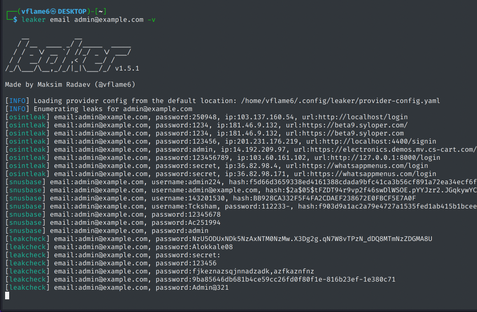

# Leaker

| **Leaker**       | **Quick Overview**                                                                                                                                                                                                         |
| ---------------- | -------------------------------------------------------------------------------------------------------------------------------------------------------------------------------------------------------------------------- |
| URL              | [https://github.com/vflame6/leaker](https://github.com/vflame6/leaker)                                                                                                                                                    |
| What it does     | Aggregates credential leak data from 12 breach databases into a single command-line interface, supporting searches by email, username, domain, keyword, and phone number with built-in deduplication and result enrichment. |
| How to use it    | Install the Go binary, configure API keys for your chosen sources, then run search commands such as `leaker email user@example.com` to query multiple breach databases at once and review consolidated results.             |
| Cost             | Free and open source. Some integrated data sources require paid API subscriptions.                                                                                                                                          |
| Account required | No (for sources with free tiers such as ProxyNova and Hudson Rock). Yes (for most other integrated sources requiring API keys).                                                                                            |
| Cookies          | None. Leaker is a command-line tool that does not use cookies or run in a browser.                                                                                                                                          |
| Ownership        | Developed by Maksim Radaev (@vflame6), an independent developer.                                                                                                                                                           |
| Use in Reporting | Useful for consolidating credential exposure checks across multiple sources in a single query, supporting breach investigations, penetration testing reconnaissance, and organisational risk assessments.                   |

### What does Leaker do?

Leaker is a passive leak enumeration tool that queries 12 different breach databases simultaneously and consolidates the results. Rather than manually searching each breach data provider individually, Leaker lets investigators run a single query and receive deduplicated, structured output from all configured sources at once.

The tool supports five search types: email addresses, usernames, domain names, keywords, and phone numbers. Results may include exposed emails, usernames, passwords, password hashes, IP addresses, phone numbers, names, database sources, and associated URLs depending on what each source returns.

**The lowdown:** Leaker is a lightweight, single-binary CLI tool that saves time by querying multiple breach databases in parallel. It is best suited for investigators and security professionals who already have API access to breach data providers and want to streamline their workflow. It does not provide its own breach data; it aggregates results from third-party sources.

### How to Use:

**1. Install Leaker using one of the available methods. The simplest is via Go:**

```
go install -v github.com/vflame6/leaker@latest
```

Pre-built binaries and Docker images are also available from the [GitHub Releases page](https://github.com/vflame6/leaker/releases).

**2. Configure your API keys by editing the provider config file at `$HOME/.config/leaker/provider-config.yaml` (auto-generated on first run):**

```yaml
leakcheck: YOUR_API_KEY
dehashed: YOUR_API_KEY
snusbase: YOUR_API_KEY
...
```

Some sources like ProxyNova require no API key. You can use `-p` flag or the `LEAKER_PROVIDER_CONFIG` environment variable to specify a custom config path.

**3. Run a search. For example, to search by email:**

```
leaker email user@example.com
```

<figure><figcaption></figcaption></figure>

**4. Refine your search with flags:**

* Restrict to specific sources: `leaker email user@example.com -s leakcheck,dehashed`
* Output as JSONL for pipeline integration: `leaker email user@example.com -j`
* Save results to file: `leaker email user@example.com -o results.txt`
* Verify credentials against HIBP: `leaker email user@example.com -V`
* Use verbose mode to see source attribution: `leaker email user@example.com -v`

**5. List your active sources to confirm configuration:**

```
leaker -L
```

### Cost

* [] Free
* [x] Partially Free
* [ ] Paid

Leaker itself is free and open source. However, most of the 12 integrated breach databases require paid API subscriptions. Two sources (ProxyNova and Hudson Rock) offer free access without API keys.

## Data Processing

### Account Required:

* [x] Yes
* [x] No

API keys are required for most integrated sources. A small number of sources work without authentication.

### Cookies:&#x20;

Not applicable. Leaker is a command-line tool and does not use cookies or operate in a browser environment.

### Use in Reporting

Leaker can support investigations by:

* Consolidating credential exposure checks across multiple breach databases in a single query.
* Identifying which specific breaches or databases contain exposed credentials for a target email, username, or domain.
* Enriching results with password verification and hash type identification.
* Producing structured JSONL output suitable for integration into automated analysis pipelines and reporting workflows.

| **Capabilities**                                                        | **Limitations**                                                                          |
| ----------------------------------------------------------------------- | ---------------------------------------------------------------------------------------- |
| Queries 12 breach databases simultaneously.                             | Does not provide its own breach data; depends entirely on third-party sources.           |
| Supports email, username, domain, keyword, and phone searches.          | Most data sources require paid API subscriptions.                                        |
| Deduplicates results across multiple sources automatically.             | Coverage depends on which sources are configured and their respective data holdings.     |
| Outputs in plain text or JSONL for pipeline integration.                | Command-line only; no graphical interface.                                               |
| Built-in credential verification via HIBP k-anonymity.                  | Results quality varies depending on the sources queried.                                 |
| Supports proxy routing and multi-key load balancing.                    |                                            |

### Summary

Leaker is a practical aggregation tool for investigators and security professionals who need to check credential exposure across multiple breach databases efficiently. 

### Ownership

Developed by [Maksim Radaev](https://github.com/vflame6) (@vflame6), an independent developer. The tool is open source and hosted on GitHub.

### Ethical Considerations

* Use strictly for legitimate investigative, security research, or defensive purposes.
* Handle any exposed personal data (credentials, emails, passwords) responsibly and in compliance with data protection regulations.
* Do not use discovered credentials to access accounts or systems without authorisation.
* Be aware that breach data may contain sensitive personal information; ensure appropriate handling and storage.
* Respect the terms of service of each integrated data provider.

### Related Tools:

* [Have I Been Pwned?](have-i-been-pwned.md)
* [Hudson Rock](hudson-rock.md)
* DeHashed
* [IntelligenceX](intelligencex.md)

#### Sources

[https://github.com/vflame6/leaker](https://github.com/vflame6/leaker)&#x20;

[https://github.com/vflame6/leaker/wiki](https://github.com/vflame6/leaker/wiki)&#x20;
