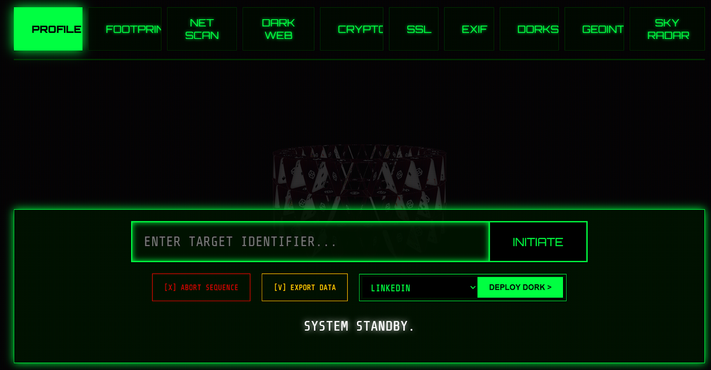

# TheBigBrother

| **TheBigBrother** | **Quick Overview**                                                                                                                                |
| ----------------- | ------------------------------------------------------------------------------------------------------------------------------------------------- |
| URL               | [https://github.com/chadi0x/TheBigBrother](https://github.com/chadi0x/TheBigBrother)                                                              |
| What it does      | Allows you to search primarily by username, alongside email lookups, domain intelligence, metadata extraction (EXIF), and cryptocurrency tracing. |
| How to use it     | Run the tool from the command line with a target email address, username, domain etc.                                                             |
| Cost              | Free.                                                                                                                                             |
| Account required  | No.                                                                                                                                               |
| Cookies           | None (runs locally).                                                                                                                              |
| Ownership         | Published by [“chadi0x”](https://github.com/chadi0x) on GitHub, based in Morocco.                                                                 |
| Use in Reporting  | Mapping digital presence, showing investigative pathways, and supporting corroboration.                                                           |

### What does TheBigBrother do?

TheBigBrother pulls together multiple recon techniques into one place, saving you from jumping between tools.&#x20;

It’s especially strong for:

* Username enumeration across platforms.
* Email and domain recon.
* Pulling hidden metadata from files.
* Following crypto wallet activity.

**The lowdown:** It’s a versatile, privacy-friendly OSINT toolkit best suited for those comfortable in the command line, who want to streamline their workflow without relying on web-based tools.

### How to Use:

**1. Run the tool from your terminal and clone the repository from GitHub.**

**2. Install required dependencies (usually via pip install -r requirements.txt)**

**3. Input your target (username, email, domain, etc.)**

<figure><figcaption></figcaption></figure>

In practice; You could start with a username to map someone’s digital footprint, pivot to email lookups for deeper identity connections. use domain tools to uncover infrastructure, extract EXIF metadata from images for location clues, and investigate crypto wallets for financial trails etc.&#x20;

You can [view our full, detailed guide in The OSINT Newsletter here. ](https://osintnewsletter.com/p/101)    &#x20;

### Cost

* [x] Free
* [ ] Partially Free
* [ ] Paid

## Data Processing

### Account Required:

* [ ] Yes
* [x] No

### Cookies:&#x20;

None (runs locally).

### Use in Reporting

TheBigBrother is useful for:

* Mapping a subject’s online presence.
* Verifying identities across platforms.
* Supporting investigations with multi-source corroboration.
* Enriching background research with technical indicators.

You can [view our example use cases here.](https://osintnewsletter.com/p/101)

| **Capabilities**                           | **Limitations**                                     |
| ------------------------------------------ | --------------------------------------------------- |
| Username search across multiple platforms. | Requires some technical setup (command-line tool).  |
| Email intelligence gathering.              | Coverage depends on integrated sources.             |
| Domain and infrastructure analysis.        | Needs manual verification.                          |
| EXIF metadata extraction from images.      | Can be slow depending on query scope.               |
| Cryptocurrency wallet tracing.             | 
 
                                         |

### Summary

TheBigBrother shines in early-stage investigations, when you’re trying to answer: “Where else does this person exist online?” It’s ideal when you want to quickly pivot between data types and you’re building a broad subject profile, but avoid relying on it when you require deep, specialised analysis and high-confidence attribution.

### Ownership

Published by [“chadi0x”](https://github.com/chadi0x) on GitHub, based in Morocco. His Twitter profile can be found [here.](https://x.com/Chadi0x)

### Ethical Considerations

* Respect privacy and legal boundaries when investigating individuals.
* Avoid misuse for harassment, doxxing, or surveillance.
* Be cautious when handling sensitive or personal data.

### Related Tools:

* Sherlock (username hunting)
* Maigret (account enumeration)
* theHarvester (email/domain OSINT)
* ExifTool (metadata extraction)
* Maltego (link analysis)

#### Sources

[https://github.com/chadi0x/TheBigBrother](https://github.com/chadi0x/TheBigBrother)&#x20;

[https://osintnewsletter.com/p/101](https://osintnewsletter.com/p/101)&#x20;

[https://x.com/Chadi0x](https://x.com/Chadi0x)
